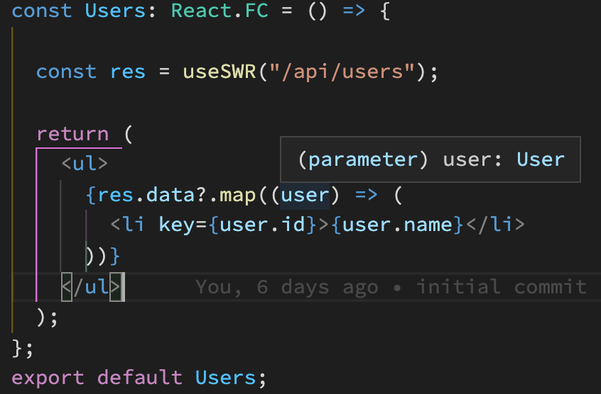

# Typed API with SWR Next.js plugin

This Next.js plugin generates a TypeScript file to enhance the `useSWR` React Hook types so the return value is typed based on the path that is being fetched.

[Example repository demonstrating it in action](https://github.com/mohsen1/automatic-use-swr-types)

## Installation

Add this plugin to your Next.js configuration file:

```ts
const withNextJsTypedApi = require("next-typed-api-with-swr");

module.exports = withNextJsTypedApi(
  {},
  {
    outputFilePath: "__generated__/swr-api-types.ts",
  }
);
```

## Usage

Make sure your API routes are typed using the `NextApiHandler` generic type exported from the `"next"` module. After running a build with this plugin enabled, calls to `useSWR` will be automatically typed based on the API path return type.

### Example

In this example we type the `"/api/users"` endpoint

```ts
// pages/api/users.ts
import { NextApiHandler } from "next";

interface User {
  id: number;
  name: string;
  email: string;
}

const handler: NextApiHandler<User[]> = (req, res) => {
  res
    .status(200)
    .json([{ id: 0, name: "John Doe", email: "john.doe@example.com" }]);
};

export default handler;
```

After running a build you should automatically get types for calls to `"/api/users"` endpoint:

```tsx
import useSWR from "swr";

const Users: React.FC = () => {
  // res.data is typed as User[]
  const res = useSWR("/api/users");

  return (
    <ul>
      {res.data?.map((user) => (
        <li key={user.id}>{user.name}</li>
      ))}
    </ul>
  );
};

export default Users;
```

<figure>
    
    <figcaption>
    A screenshot of code of client side code demonstrating automatic types assigned to <code>res.data</code>
    </figcaption>
</figure>
